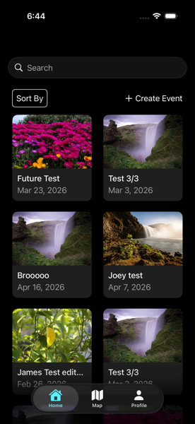
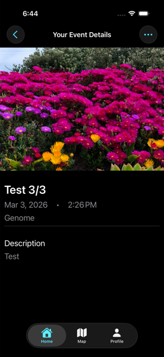
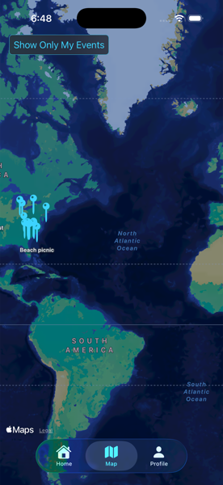
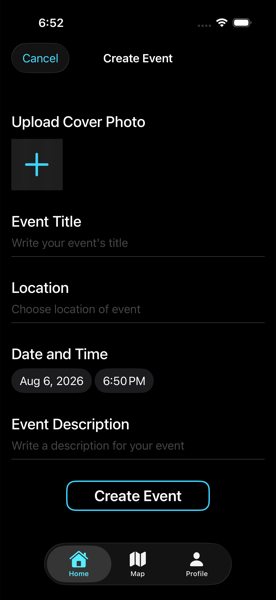
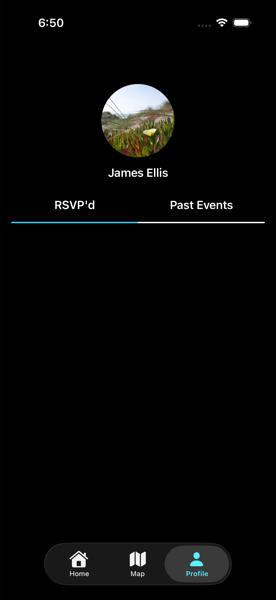
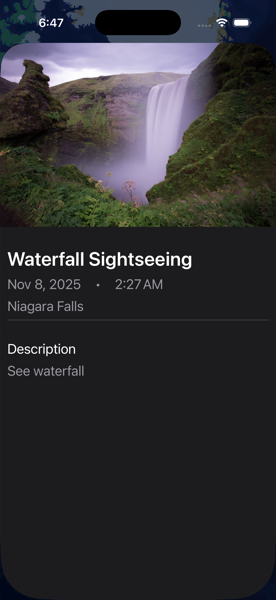

# Gatherly

Gatherly is an iOS app for discovering, creating, and RSVP-ing to campus events. Browse what's happening nearby on a map or in a searchable feed, create your own event with a cover photo, and keep track of what you've RSVP'd to from your profile.

## Features

- **Event feed** — Browse all events in a two-column grid, search by title, and sort alphabetically or by "Upcoming."
- **Event details** — View an event's cover photo, date/time, location, and description. RSVP with one tap.
- **Create & edit events** — Add a new event with a title, location, date/time, description, and cover photo (uploaded via `PhotosPicker`). Event creators can edit or delete their own events.
- **Map view** — See all events plotted on a map, geocoded from their listed location. Toggle between all events and only the ones you created.
- **Profile** — View your RSVP'd and past events in separate tabs, set a profile photo, and remove events you've RSVP'd to.
- Pull-to-refresh on the home feed and event detail screen, plus error alerts with retry for failed network requests.

## Architecture

Gatherly is built with **SwiftUI** using an **MVVM** pattern:

- **Views** (`Gatherly/Views`, `Gatherly/Location`) — SwiftUI views for the home feed, event detail, add/edit event, map, and profile screens.
- **View Models** — `@Observable` classes (`EventViewModel`, `EventDetailViewModel`, `AddEventViewModel`, `EditEventViewModel`, `EventsMapViewModel`, `ProfileViewModel`) own screen state, loading/error handling, and calls into the service layer.
- **Models** (`Gatherly/Models`) — `Event` (network model), `RSVPedEvent` / `UserProfile` (persisted with **SwiftData**), `LoadingState`, `ErrorType`.
- **EventService** — A singleton networking layer (`URLSession` + `Codable`) that talks to the Gatherly backend for fetching, creating, editing, and deleting events.
- **Location** — `EventsMapViewModel` geocodes event addresses with `CLGeocoder` for display on a `MapKit` map.

Local persistence (RSVP'd events, profile photo) uses SwiftData, while event data itself is fetched from a remote backend at `gatherly-backend-q9vm.onrender.com`.

## Tech Stack

- Swift / SwiftUI
- SwiftData (local persistence)
- MapKit & CoreLocation (event map + geocoding)
- PhotosUI (`PhotosPicker` for image selection)
- `URLSession` + `Codable` for networking

## Requirements

- Xcode 26+
- iOS 26.2+ deployment target

## Getting Started

1. Clone the repository.
2. Open `Gatherly.xcodeproj` in Xcode.
3. Select a simulator or device and run (`⌘R`).

## Screenshots

| Home | Event Detail | Map |
| --- | --- | --- |
|  |  |  |

| Create Event | Profile | Map Pin Detail |
| --- | --- | --- |
|  |  |  |
